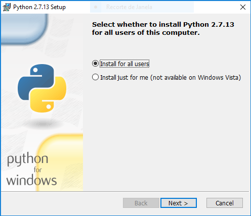
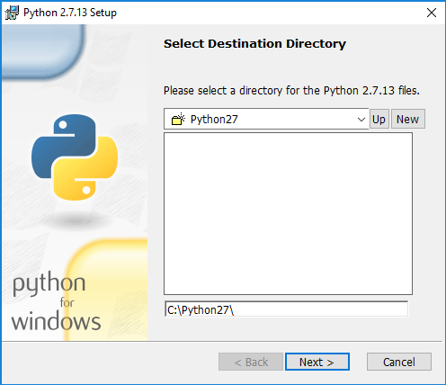
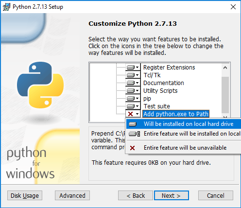

# Install Python + QuickWeb on Windows
This page will guide you on how to install Python and QuickWeb on Windows.

1. Download Python 2.7 from https://www.python.org/downloads/

2. Install it using the .previously downloaded .msi file:

    

3. Install to the default install folder:

    

4. **Enable the "Add python.ext to PATH"** at the bottom of the options:

    

    

5.  Open a command prompt, install quickweb with the command:

    `pip install quickweb`

6. List the available QuickWeb templates, with the command:

    `quickweb templates`

 7. Create your application using one of the templates using the command:

    `quickweb create my-web-app bootstrap-navbar-fixed-top`

8.  Run your web application using the command:

    `quickweb run my-web-app`

9.  Check it with your  browser, should be available at http://127.0.0.1:8080 .

